<!-- ===================== HEADER ===================== -->

<div align="center">

# 👋 Hi, I'm Mahak Kaur Chhabra

### Frontend Lead · Software Developer · AI & Automation Enthusiast

<p>
  
</p>

<p>
  <a href="https://github.com/mahak1808">
    
  </a>
  <a href="https://www.linkedin.com/in/mahak1808/">
    
  </a>
  <a href="mailto:[mchhabra1808@gmail.com](mailto:mchhabra1808@gmail.com)">
    
  </a>
  <a href="https://mahak1808.github.io">
    
  </a>
</p>


</div>

---

## 👩‍💻 About Me

I'm a **Software Developer Associate & Frontend Lead** who enjoys turning ideas into real, usable products.

My work sits at the intersection of **frontend engineering, product development, AI, and automation**. I've worked on cross-platform applications, internal business systems, AI-powered tools, workflow automation, and client-facing products.

I enjoy taking ownership beyond just writing code — from **understanding requirements and designing interfaces to API integration, deployment, mentoring developers, and shipping products.**

```text
💻 Frontend Development     → React · React Native · JavaScript
🤖 AI & Automation          → LLMs · RAG · n8n · AI Workflows
☁️ Platforms & APIs         → Firebase · Supabase · Google APIs
🧰 Engineering              → Git · GitHub · Docker · API Integration
👩‍💻 Leadership               → Frontend Leadership · Mentoring · PR Reviews
```

---

## 🚀 What I've Built

<div align="center">

|  🚚 Logistics | 📊 Business Systems |  🤖 AI & Automation  |
| :-----------: | :-----------------: | :------------------: |
|  **Farewell** |       **BMS**       |      **Veritas**     |
|  React Native |   React · Supabase  |       AI · LLMs      |
| Live Tracking | Workflow Automation | Meeting Intelligence |

</div>

### 🚚 Farewell — Logistics App

A cross-platform logistics application serving US customers with parcel delivery workflows.

**Highlights**

* 📦 Instant & scheduled parcel deliveries
* 🗺️ Google Maps-based booking flows
* 📍 Live rider tracking & location polling
* 🔔 Notifications & API integrations
* 📱 React Native + Firebase
* 🚛 UPS, USPS & FedEx workflows
* 🚀 App Store approval within **2–3 days**

> **Role:** Frontend Lead

---

### 📊 Bid Management System — BMS

A business management platform built from scratch to replace manual Excel-based workflows.

**Highlights**

* ⚡ Improved task management by **60%+**
* 📋 Replaced manual spreadsheet workflows
* 🔎 Filtering & status management
* 📅 Date-based workflows
* 📤 Data export functionality
* 👥 Used by **10+ team members**

> **Role:** Developer · Product Owner

---

### 👥 Human Resource Management System — HRMS

A company-wide HR platform used by employees for internal workflows.

**Includes**

`Attendance` · `Leave Tracking` · `Payroll` · `Communication` · `Employee Management`

> **Role:** Developer

---

### 🤖 Veritas — AI Meeting Assistant

An AI-driven meeting transcription and response tool designed to surface **contextual insights during client calls**.

**Focus**

`AI` · `LLMs` · `Meeting Intelligence` · `Contextual Insights`

---

### 🧠 AI Automated Personal Assistant

A modular AI assistant built with **n8n and LLMs** to automate everyday tasks.

**Integrations**

`Google Sheets` · `Google Drive` · `Gmail` · `Calendar` · `Telegram`

Designed with reusable automation modules for productivity and scalability.

---

### 🎬 Movie Recommendation System

A content-based movie recommendation system built with Python.

**Stack**

`Python` · `Pandas` · `NumPy` · `Streamlit` · `Hugging Face Spaces`

---

# 🛠️ Tech Stack

## 💻 Languages

<p>


</p>

## 🎨 Frontend

<p>


</p>

## ⚙️ Backend, Database & APIs

<p>


</p>

## 🤖 AI, LLMs & Automation

<p>


</p>

## 📊 Data & Machine Learning

<p>


</p>

## 🧰 Tools & DevOps

<p>


</p>

## ☁️ Platforms & Integrations

<p>


</p>

---

# 💼 Professional Experience

### Software Developer Associate - Frontend Lead & Team Mentor

**Mechlin Technologies · May 2025 - Present**

* 👩‍💻 Led frontend development for **Farewell**, a React Native logistics application.
* 📍 Implemented live tracking, location polling and map-based booking flows.
* 📦 Integrated parcel delivery workflows involving UPS, USPS and FedEx.
* 📊 Built **BMS from scratch**, improving task management by **60%+**.
* 👥 Built and maintained the company-wide **HRMS**.
* 🤖 Developed **Veritas**, an AI-driven meeting transcription and response tool.
* 🤝 Managed **ClientSphere**, including requirements gathering, coordination and PR reviews.
* 🧑‍🏫 Mentored **6 interns & SDAs** across real-world projects.
* ⚡ Automated social media publishing across LinkedIn, Instagram and Facebook using **n8n**.
* 🔐 Integrated API-based authentication and Microsoft services.
* 🧠 Developed a **RAG solution** for internal knowledge access.
* 🐳 Used Docker for containerized deployment.
* 🔀 Worked with Git/GitHub for version control and collaboration.

---

# 📈 Impact

<div align="center">


</div>

---

# 🏆 Achievements

<div align="center">

🏅 **Top Performer of My Batch**

⭐ **5 Stars in C++ — HackerRank**

🎓 **GATE CS 2024 — AIR 14161**

🌎 **IELTS — 7.5 Bands**

🤖 **NPTEL — Deep Learning**

💻 **NPTEL — Computer Architecture**

📊 **Samatrix — R, Data Analysis, Statistics & Intro to AI**

</div>

---

# 🎓 Education

<div align="center">

### BTech — Computer Science & Engineering + AI/ML

**Career Point University, Kota**

`2021 – 2025`

### ⭐ CGPA: 9.93 / 10

</div>

---

# 🌱 Currently Exploring

- 🤖 AI-powered developer tools
- 🧠 LLM applications & RAG
- ⚡ Workflow automation with n8n
- 📱 Scalable React & React Native applications
- 🌐 Full-stack development
- 🚀 AI + Software + Automation

---
# 📊 GitHub Analytics

<div align="center">





</div>

<br>

<div align="center">


</div>

---

# 🐍 Contribution Graph

<div align="center">

<picture>
  <source
    media="(prefers-color-scheme: dark)"
    srcset="https://raw.githubusercontent.com/mahak1808/mahak1808/output/github-contribution-grid-snake-dark.svg"
  />
  <source
    media="(prefers-color-scheme: light)"
    srcset="https://raw.githubusercontent.com/mahak1808/mahak1808/output/github-contribution-grid-snake.svg"
  />
  
</picture>

</div>

---

# 🤝 Let's Connect

<div align="center">

I'm always interested in **building interesting products, collaborating on projects, and exploring opportunities in frontend engineering, AI and automation.**

<br>

<a href="mailto:[mchhabra1808@gmail.com](mailto:mchhabra1808@gmail.com)">

</a>

<a href="https://github.com/mahak1808">

</a>

<a href="https://mahak1808.github.io">

</a>

</div>

---

<div align="center">

### 💜 Thanks for stopping by!

**"Build. Learn. Automate. Repeat."**

<br>


</div>

<!--
**mahak1808/mahak1808** is a ✨ _special_ ✨ repository because its `README.md` (this file) appears on your GitHub profile.

Here are some ideas to get you started:

- 🔭 I’m currently working on ...
- 🌱 I’m currently learning ...
- 👯 I’m looking to collaborate on ...
- 🤔 I’m looking for help with ...
- 💬 Ask me about ...
- 📫 How to reach me: ...
- 😄 Pronouns: ...
- ⚡ Fun fact: ...
-->
